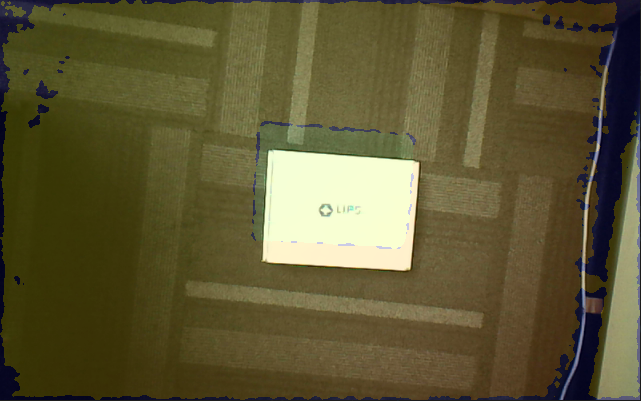
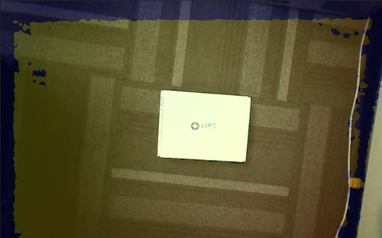

# Align Depth and Color Frame

## Overview

The depth sensor and the RGB sensor are positioned differently on the camera, resulting in a slight displacement between the images captured by each sensor. To align the depth and RGB images, we need to enable the "Registration" setting.

## Expect Output

- Registration disabled
  

- Registration enabled
  

## Tutorial

Modify from [opencv_viewer](../opencv_viewer/README.md). After getting color and depth frame, we use opencv `addWeighted` function to overlap these two images.

```c++
cv::addWeighted(colorMat, 0.8, depthMat, 0.2, 0.0, overlappingMat);
```

To turn on/off registraion, Use `setImageRegistrationMode` in SDK and give proper parameter.

```c++
// Enable
device.setImageRegistrationMode(openni::IMAGE_REGISTRATION_DEPTH_TO_COLOR);

//Disable
device.setImageRegistrationMode(openni::IMAGE_REGISTRATION_OFF);
```

Use variable `enableRegistration` to determinate whether to enable registration. When press 'a' on keyboard, turn on/off registration.

```c++
input = cv::waitKey(1);
if (input == 'a')
{
    enableRegistration = !enableRegistration;
    device.setImageRegistrationMode(enableRegistration ? openni::IMAGE_REGISTRATION_DEPTH_TO_COLOR openni::IMAGE_REGISTRATION_OFF);
    std::cout << "Image Registration: " << (enableRegistration ? "Enable" : "Disable") << std::endl;
}
```

## Full code

[align-depth-color.cpp](./align-depth-color.cpp)
