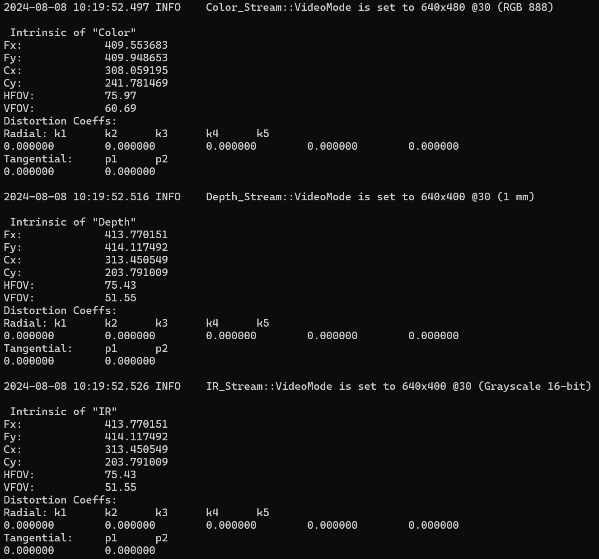

# Camera Parameter

## Overview

Get the parameters of the camera intrinsic and distortion values.

## Expect Output



## Prerequisite

- [Hello LIPSEdge SDK](../hello-lipsedge-sdk/)

## Tutorial

We first include `LIPSNICustomProperty.h` which is inside our LIPSEdge SDK. This header file provide multiple handy functions and data structs like `RadialDistortionCoeffs`, `radialDistCoeffs` etc.

```cpp
#include "LIPSNICustomProperty.h"
```

To get different parameters we use `openni::VideoStream::getProperty()` with different property index. All of this index are defined inside `LIPSNICustomProperty.h`

```cpp
vs.getProperty(ONI_STREAM_PROPERTY_HORIZONTAL_FOV, &hfov);
vs.getProperty(ONI_STREAM_PROPERTY_VERTICAL_FOV, &vfov);
vs.getProperty(LIPS_STREAM_PROPERTY_FOCAL_LENGTH_X, &fx);
vs.getProperty(LIPS_STREAM_PROPERTY_FOCAL_LENGTH_Y, &fy);
vs.getProperty(LIPS_STREAM_PROPERTY_PRINCIPAL_POINT_X, &cx);
vs.getProperty(LIPS_STREAM_PROPERTY_PRINCIPAL_POINT_Y, &cy);
vs.getProperty(LIPS_STREAM_PROPERTY_RADIAL_DISTORTION, &radialDistCoeffs);
vs.getProperty(LIPS_STREAM_PROPERTY_TANGENTIAL_DISTORTION, &tangentialDistCoeffs);
```

Different sensor has different parameters. We use each VideoStream to get the parameters.

```cpp
VideoStream color;
color.create(device, SENSOR_COLOR);
printStreamParameters("Color", color);

VideoStream depth;
depth.create(device, SENSOR_DEPTH);
printStreamParameters("Depth", depth);

VideoStream ir;
ir.create(device, SENSOR_IR);
printStreamParameters("IR", ir);
```

## Full code

[camera-parameter.cpp](https://github.com/HedgeHao/LIPSedgeSDK_Tutorial/blob/master/c%2B%2B/camera-parameter/camera-parameter.cpp)
