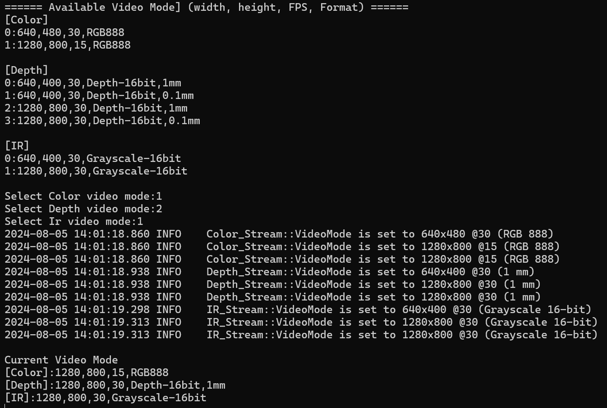

# Config Resolution

## Overview

In LIPSEdge SDK, we use video mode to set different resolution, FPS and data format. This example shows you how to use video mode settings.

## Expect Output



## Prerequisite

- [OpenCV Viewer](../opencv_viewer/)

## Tutorial

We first get all available video modes of each stream by the following code. Video mode include resolution, FPS and pixel format information.
```cpp
const openni::SensorInfo *colorInfo = device.getSensorInfo(SENSOR_COLOR);
const openni::SensorInfo *depthInfo = device.getSensorInfo(SENSOR_DEPTH);
const openni::SensorInfo *irInfo = device.getSensorInfo(SENSOR_IR);

auto &colorVideoModes = colorInfo->getSupportedVideoModes();
auto &depthVideoModes = depthInfo->getSupportedVideoModes();
auto &irVideoModes = irInfo->getSupportedVideoModes();
```

Then we print out all of them. Pixel format store as integer number. We use `pixelFormatToString` to convert them to string.
```cpp
std::string pixelFormatToString(PixelFormat format)
{
    switch (format)
    {
    // Depth
    case PIXEL_FORMAT_DEPTH_100_UM:
        return "Depth-16bit,0.1mm";
        break;
    case PIXEL_FORMAT_DEPTH_1_MM:
        return "Depth-16bit,1mm";
        break;

        ...
    }
}
```

We ask user to enter number to select the desired video mode
```cpp
std::string input;
int colorSelection = 0, depthSelection = 0, irSelection = 0;

std::cout << "Select Color video mode:";
std::cin >> input;
colorSelection = atoi(input.c_str());

std::cout << "Select Depth video mode:";
std::cin >> input;
depthSelection = atoi(input.c_str());

std::cout << "Select Ir video mode:";
std::cin >> input;
irSelection = atoi(input.c_str());
```

Before starting streams, we set the video mode first
```cpp
VideoStream color;
color.create(device, SENSOR_COLOR);
color.setVideoMode(colorVideoModes[colorSelection]);
color.start();

VideoStream depth;
depth.create(device, SENSOR_DEPTH);
depth.setVideoMode(depthVideoModes[depthSelection]);
depth.start();

VideoStream ir;
ir.create(device, SENSOR_IR);
ir.setVideoMode(irVideoModes[irSelection]);
ir.start();
```

We can get current video mode from stream object to check video mode has been set.
```cpp
VideoMode colorMode = color.getVideoMode();
VideoMode depthMode = depth.getVideoMode();
VideoMode irMode = ir.getVideoMode();
```

## Full code

[config-resolution.cpp](https://github.com/HedgeHao/LIPSedgeSDK_Tutorial/blob/master/c%2B%2B/config-resolution/config-resolution.cpp)