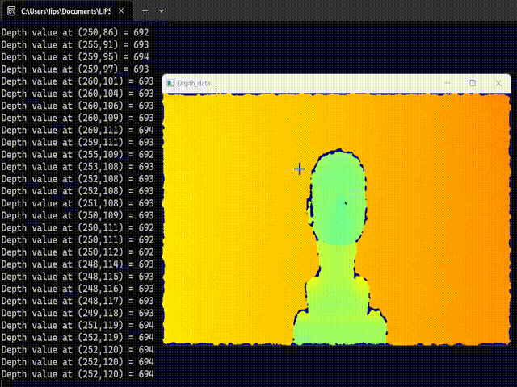

# Depth Data

## Overview

The most important thing while using 3D cameras is to get the depth value. This demo shows how to get the depth data from camera frame. Move the mouse in an OpenCV window and obtain the depth value of the mouse cursor position.

## Expect Output



## Prerequisite

- [OpenCV Viewer](../opencv_viewer/)

## Tutorial

- By adding mouse callback function on OpenCV window, we can get the (x,y) coordinate when mouse move over the window.

```cpp
void onMouseMove(int event, int x, int y, int flags, void *userdata)
{
    if (event == cv::EVENT_MOUSEMOVE)
    {
        std::cout << "Mouse coordinate (x,y) = " << x "," << y << std::endl;
    }
}

cv::namedWindow("Depth Data");
cv::setMouseCallback("Depth Data", onMouseMove, NULL);

```

- After converting depthFrame to OpenCV Mat format, we can retrieve the the data by `cv::Mat::data`. Depth data is store in two bytes, so we use `int16_t*` to access the data.

```cpp
cv::Mat depthMat;
...
uint16_t *depthData = (uint16_t *)depthMat.data;
```

- Depth data is store in row-major format. You can use the following code to get the value from given x and y coordinate.

```cpp
uint16_t depthValue = depthData[y * depthMat.cols + x];
```

## Full code

[depth_data.cpp](https://github.com/HedgeHao/LIPSedgeSDK_Tutorial/blob/master/c%2B%2B/depth_data/depth_data.cpp)
