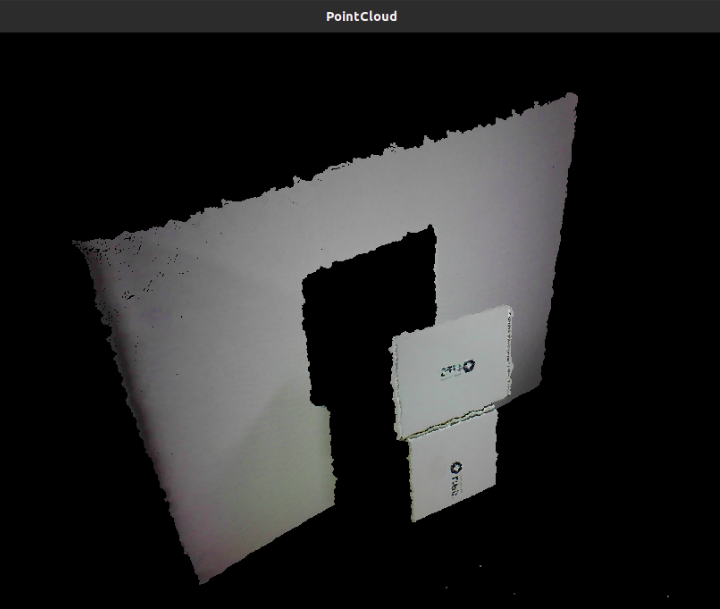

# Point Cloud

## Overview

Use depth value to calculate point cloud. Using OpenGL(GLFW) to display.

## Expect Output



## Prerequisite

- [OpenCV Viewer](../opencv_viewer/)

To use OpenGL, we need to install GLFW library.

### Windows

Download prebuilt from [GFLW](https://www.glfw.org/download). Unzip then set the path in `CMakeList.txt`

```text
// CMakeLists.txt
...
include_directories("GLFW_HEADER_PATH")
link_directories("GLFW_LIBRARY_PATH")

target_link_libraries(${PROJECT_NAME} glfw GLU GL)
...
```

### Linux

Install by `apt`.

```bash
sudo apt-get install libglfw3-dev
```

Add linked libraries in `CMakeLists.txt`

```text
// CMakeLists.txt
...
target_link_libraries(${PROJECT_NAME} glfw GLU GL)
...
```

## Tutorial

We declare `pointData` to store the pointcloud data of each voxel, including its depth value, coordinate in world coordinate system and the color value of that point.

```cpp
struct pointData
{
    unsigned short depth;
    float worldX, worldY, worldZ;
    float r, g, b;
};
```

In `computeCloud` function, we get the color and depth frame. Then loop each depth value, use `convertDepthToWorld` to covert to world coordinate system. Also, we get the color value of each point from RGB color frame.

```cpp
void computeCloud(int width, int height, VideoStream &depth, VideoStream &color, VideoFrameRef &colorFrame, VideoFrameRef &depthFrame)
{
    color.readFrame(&colorFrame);
    depth.readFrame(&depthFrame);

    const openni::DepthPixel *pDepth = (const openni::DepthPixel *)depthFrame.getData();
    const openni::RGB888Pixel *pColor = (const openni::RGB888Pixel *)colorFrame.getData();

    float fX, fY, fZ;

    for (int y = 0, i = 0; y < height; y++)
    {
        for (int x = 0; x < width; x++)
        {
            fX = 0.0;
            fY = 0.0;
            fZ = 0.0;
            pointsData[i].depth = pDepth[i];

            if (pDepth[i] != 0)
            {

                openni::CoordinateConverter::convertDepthToWorld(depth, x, y, pDepth[i], &fX, &fY, &fZ);

                pointsData[i].worldX = fX;
                pointsData[i].worldY = fY;
                pointsData[i].worldZ = fZ;

                pointsData[i].r = pColor[i].r / 255.0;
                pointsData[i].g = pColor[i].g / 255.0;
                pointsData[i].b = pColor[i].b / 255.0;
            }
            i++;
        }
    }

    return;
}
```

In `main` function, we first initialize the camera like we did before. Make sure to enable image registration to align depth and color frame.

```cpp
    OpenNI::initialize();

    Device device;
    if (device.open(ANY_DEVICE) != STATUS_OK)
    {
        std::cout << "No device connect\n";
        return -1;
    }

    device.setImageRegistrationMode(openni::IMAGE_REGISTRATION_DEPTH_TO_COLOR);

    // Color
    VideoStream color;
    color.create(device, SENSOR_COLOR);
    color.start();
    VideoFrameRef colorFrame;

    // Depth
    VideoStream depth;
    depth.create(device, SENSOR_DEPTH);
    depth.start();
    VideoFrameRef depthFrame;
```

Then we initialize GLFW and create the window.

```cpp
glfwInit();
GLFWwindow *window = glfwCreateWindow(1280, 720,"PointCloud", NULL, NULL);
if (!window)
{
    glfwTerminate();
    return false;
}
glfwMakeContextCurrent(window);
```

In the window, we want to use mouse or keyboard to change to view angle. First we declare a `ViewerState` struct to store the current view angle information.

```cpp
struct viewerState
{
    double yaw;
    double pitch;
    double lastX;
    double lastY;
    float offset;
    float lookatX;
    float lookatY;
    bool mouseLeft;
    bool mouseRight;
};
```

After creating GLFW window, we use four different callbacks to handle keyboard or mouse interaction.

```cpp
glfwSetMouseButtonCallback(window, mouse_button_callback);
glfwSetScrollCallback(window, scroll_callback);
glfwSetCursorPosCallback(window, cursor_position_callback);
glfwSetKeyCallback(window, key_callback);
```

In main while loop, we compute the pointcloud then use GLFW functions to keep refresing window.

```cpp
while (!glfwWindowShouldClose(window))
{
    glfwPollEvents();

    computeCloud(depthWidth, depthHeight, depth, color, colorFrame, depthFrame);

    ...
    // Render pointcloud
    ...

    glfwSwapBuffers(window);
}
```

To render each point on screen, first we change the view angle base on current `viewerState` value.

```cpp
int windowWidth, windowHeight;
glfwGetFramebufferSize(window, &windowWidth, &windowHeight);

glViewport(0, 0, windowWidth, windowHeight);
glClearColor(0.0, 0.0, 0.0, 1);
glClear(GL_COLOR_BUFFER_BIT | GL_DEPTH_BUFFER_BIT);
glMatrixMode(GL_PROJECTION);
glLoadIdentity();
gluPerspective(60, (float)windowWidth / windowHeight, 0.01f, 100000.0f);
glMatrixMode(GL_MODELVIEW);
glLoadIdentity();
gluLookAt(viewerStat.lookatX, viewerStat.lookatY, 0, viewerStat.lookatX, viewerStat.lookatY, 1, 0, 1, 0);

glPointSize(windowWidth / 640.0);
glEnable(GL_DEPTH_TEST);

glTranslatef(0, 0, viewerStat.offset);
glRotated(viewerStat.pitch, 1, 0, 0);
glRotated(viewerStat.yaw, 0, 1, 0);
glTranslatef(0, 0, -0.5f);
```

Then actually render each point with the coordinate and color value we get from `computePointCloud`.

```cpp
glBegin(GL_POINTS);
for (int i = 0; i < (depthWidth * depthHeight); i++)
{
    if (pointsData[i].depth != 0)
    {
        glColor3f(pointsData[i].r, pointsData[i].g, pointsData[i].b);
        glVertex3f(pointsData[i].worldX, pointsData[i].worldY, pointsData[i].worldZ);
    }
}
glEnd();
```

## Full code

[pointcloud.cpp](https://github.com/HedgeHao/LIPSedgeSDK_Tutorial/blob/master/c%2B%2B/align-depth-color/pointcloud.cpp)
