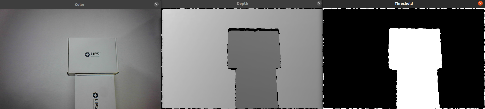

# Range filter

## Overview

Since depth camera can measure the distance for each pixel. We can easily build a range filter, focusing of specific distance of data that we want are interesting in.

## Expect Output



## Tutorial

Modify from [opencv_viewer](../opencv_viewer/README.md). After getting color and depth frame, we use opencv `threshold` function to filter out distance less than `threasholdValueDown` and greater than `thresholdValueUp`.

The distance units used by the SDK vary depending on the camera. In this example, we use the LIPSEdge L215 camera, which uses millimeters (mm) as the unit. So, here we set the distance limit from 500mm to 1500mm.

```c++
double thresholdValueUp = 1500;
double thresholdValueDown = 500;

...

cv::threshold(thres, thres, thresholdValueDown, 1024, cv::THRESH_TOZERO);
cv::threshold(thres, thres, thresholdValueUp, 1024, cv::THRESH_TOZERO_INV);
```

Then we do the threshold again, to convert all the remaining depth value to 1, and the other value to 0. This create a region of interest (white area) base on distance.

```c++
cv::threshold(thres, thres, 1, 1024, cv::THRESH_BINARY_INV);
```

Finally, convert `depth` and `thres` to gray scale value then display all of it

````c++
depthMat.convertTo(depthMat, CV_8UC1, 255.0 / 1024.0);
thres.convertTo(thres, CV_8UC1, 255.0 / 1024.0);

cv::imshow("Color", colorMat);
cv::imshow("Depth", depthMat);
cv::imshow("Threshold", thres);
        ```
````

## Full code

[range-filter](./range-filter.cpp)
