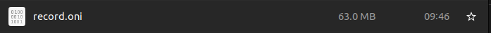
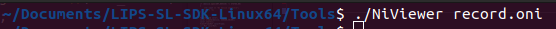

# Remove Background

## Overview

This example shows you how to remove the background of an image using depth camera with range filter.

## Expect Output

After recording, we will get a `record.oni` file. Using `NiViewer`, you can replay the recording frames.






## Prerequisite

- [Hello LIPSEdge SDK](../hello-lipsedge-sdk/)

## Tutorial

Create a `openni::Recorder` object to control the recording.
```cpp
 Recorder recorder;
if (recorder.create("record.oni") != STATUS_OK)
{
    std::cout << "Cannot create recorder" << std::endl;
    return -2;
}
```

You can choose which stream you want to attach. Here we attach all 3 streams.

```cpp
recorder.attach(color);
recorder.attach(depth);
recorder.attach(ir);
```

Then we use `start()` to record and `stop()` to stop.
```cpp
recorder.start();

recorder.stop();
```

## Full code

[record](https://github.com/HedgeHao/LIPSedgeSDK_Tutorial/blob/master/c%2B%2B/record/record.cpp)