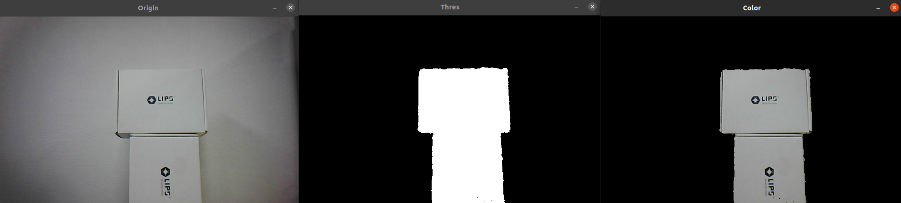

# Remove Background

## Overview

This example shows you how to remove the background of an image using depth camera with range filter.

## Expect Output



## Prerequisite

- [OpenCV Viewer](../opencv_viewer/)
- [Align Depth & Color](../align-depth-color/)
- [Range Filter](../range-filter/)

## Tutorial

Modify from [range-filter](../range-filter/), we add two variables to determinate the desired distance. Then add two keyboard shorcut to set these values.

```cpp
double thresholdValueUp = 530;
double thresholdValueDown = 385;
char input;

input = cv::waitKey(1);
if (input == 'p')
{
    if (thresholdValueUp + 5 <= 2000)
        thresholdValueUp += 5;
    else
        thresholdValueUp = 2000;

    std::cout << "Threshold Value (Up):" << thresholdValueUp << " (Down):" << thresholdValueDown << std::endl;
}
else if (input == 'o')
{
    if (thresholdValueUp - 5 >= 0 && thresholdValueUp - 5 >= thresholdValueDown)
        thresholdValueUp -= 5;

    std::cout << "Threshold Value (Up):" << thresholdValueUp << " (Down):" << thresholdValueDown << std::endl;
}
else if (input == 'x')
{
    if (thresholdValueDown + 5 <= 2000 && thresholdValueDown + 5 <= thresholdValueUp)
        thresholdValueDown += 5;

    std::cout << "Threshold Value (Up):" << thresholdValueUp << " (Down):" << thresholdValueDown << std::endl;
}
else if (input == 'z')
{
    if (thresholdValueDown - 5 >= 0)
        thresholdValueDown -= 5;
    else
        thresholdValueDown = 0;

    std::cout << "Threshold Value (Up):" << thresholdValueUp << " (Down):" << thresholdValueDown << std::endl;
}
```

Using these two values to create range filter mask image like we did before.

```cpp
cv::threshold(thres, thres, thresholdValueDown, 1024, cv::THRESH_TOZERO);
cv::threshold(thres, thres, thresholdValueUp, 1024, cv::THRESH_TOZERO_INV);
cv::threshold(thres, thres, 1, 1024, cv::THRESH_BINARY);
```

Then we use OpenCV `bitwise_and` operation on the color image and the mask. We also need to convert the mask to `CV_8UC1` because that the format needed by `bitwise_and`. Finally we will get the result image that remove the background.

```cpp
thres.convertTo(thres, CV_8UC1, 255.0 / 1024.0);
cv::Mat res;
cv::bitwise_and(colorMat, colorMat, res, thres);
```

## Full code

[remove-background.cpp](https://github.com/HedgeHao/LIPSedgeSDK_Tutorial/blob/master/c%2B%2B/opencv_viewer/remove-background.cpp)
